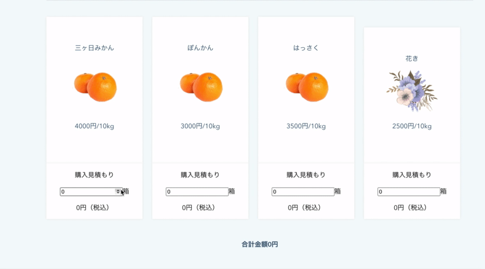

<h2 align="center">おいしいみかんやさん</h2>

# 概要
**みかん農家**のSPAのWebサイトです。

# 制作期間
7日間

# 制作背景
## 技術的な背景
TECHCAMPでは、jQueryを使用することが多く、フロントエンドにおける世界的なスタンダードであるReactの学習をする必要があると思った。

## 個人的な背景
私の実家は、静岡で有名なみかん農家です。しかしながら、農業業界はIT化が進んでおらず、出荷先のほとんどが農協であり、市場開拓の選択肢が少ないと考えております。そこで、祖父母のWebサイト作成することで、さらなる周知が可能だと思いました。また、これまでお世話になった祖父母に、何か役に立つことがしたかったということも大きな要因です。

# DEMO

### 1. 三ヶ日みかんとは

### 2. 私たちのみかんが選ばれる3つの理由

### 3.　私たちが作っています！

### 4.　選べる農作物

### 5.　購入方法

### 6.　お問い合わせ

# 工夫したポイント
- 農家の暖かく・優しい雰囲気を表現するため、フォントを丸ゴシックにし、文字の間隔を適度に開けました。
- Reactを用いて、コンポーネントで運用・管理することで、わかりやすい構造にしました。また、SPAを意識することで、操作性が高く、使いやすい設計にしました。
- 税込価格の見積もりを瞬時に出せるようにしました。

# 課題や今後実装したい機能
- お問い合わせフォームを実際に指定したアドレスに送れるようにする。
- 決済機能を実装して、オンラインでも農作物を買えるようにする

# 使用技術(開発環境)
React/HTML/CSS/Github/Visual Studio Code
